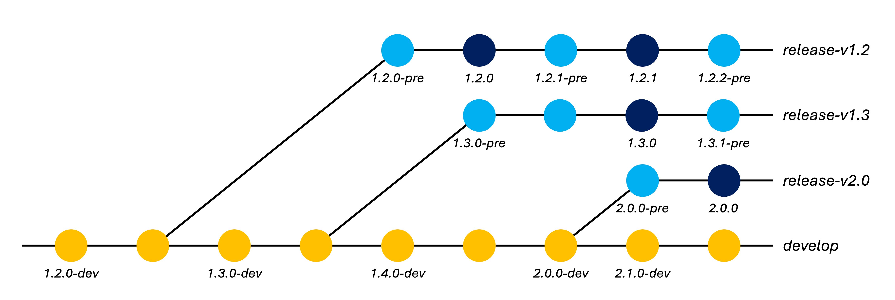

# Release procedure

## Background

### Release branches

Development of ISCE3 follows a [forking
workflow](https://www.atlassian.com/git/tutorials/comparing-workflows/forking-workflow),
with developers merging changes from their forks into the default (`develop`) branch of
the upstream repository.

From time to time, the team makes versioned releases of ISCE3. Major and minor releases
may include changes to existing interfaces and/or new features. Patch releases contain
bug fixes that have been back-ported to old versions of the software, without interface
changes.

In preparation for major or minor software releases (usually 2-3 weeks before the
release date), the ISCE3 team conducts a "feature freeze" wherein development of new
features is temporarily paused -- only bug fixes should be merged during this time.
There is typically no feature freeze period for patch releases.

In order to facilitate back-porting bug fixes, and to avoid delaying development toward
future releases during the feature freeze period, the team creates a new *release
branch* at the start of the feature freeze. The release branch remains frozen while new
features can continue to be merged into `develop`. Later on, bug fixes can be
[cherry-picked](https://git-scm.com/docs/git-cherry-pick) from the `develop` branch back
to the release branch (or any older release branch).

Release branches are named according to the major and minor version of the software as
`release-v<MAJOR>.<MINOR>` (e.g. `release-v1.2`).

### Versioning

ISCE3 follows a [semantic versioning scheme](https://semver.org/)  which differs from
the NISAR SDS release numbering scheme. Release versions of ISCE3 always conform to the
format `<MAJOR>.<MINOR>.<PATCH>` (e.g. `1.2.3`).

Non-release versions of ISCE3 additionally have a suffix appended to their version
string, marking them as a development builds or pre-release versions, in order to
distinguish them from official releases.

Each commit of ISCE3 on the `develop` branch should be suffixed with `-dev`.  Each
commit of ISCE3 on a release branch (e.g. `release-v1.2`) -- except for commits
corresponding to a tagged release -- should be suffixed with `-pre`. The suffix may also
include the Git hash of the current commit, if available, possibly with a `-dirty`
suffix if the source directory had uncommitted local changes.

| Type | Suffix | Example(s) | Notes |
|---|---|---|---|
| Release | | `1.2.3` | Tagged releases only |
| Development | `-dev`<br>`-dev+<git-hash>`<br>`-dev+<git-hash>-dirty` | `1.3.0-dev`<br>`1.3.0-dev+72e70b4db`<br>`1.3.0-dev+72e70b4db-dirty` | All commits on the<br>`develop` branch |
| Pre-release | `-pre`<br>`-pre+<git-hash>`<br>`-pre+<git-hash>-dirty` | `1.2.4-pre`<br>`1.2.4-pre+aabbea82c`<br>`1.2.4-pre+aabbea82c-dirty` | All commits on release<br>branches, except for<br>tagged commits |

/// caption
**Table 1.** ISCE3 version suffixes.
///

The `VERSION.txt` file at the root of the repository stores the ISCE3 version string.
This file is parsed by CMake during ISCE3 builds in order to populate standard version
information in the C++ library and Python package. The `VERSION.txt` file does not
include the Git hash -- it will be automatically appended by the CMake build scripts (if
possible).

The version string, including the optional suffix, is intended to conform to the [PyPA
version specifier
schema](https://packaging.python.org/en/latest/specifications/version-specifiers/#version-specifiers).

## Release procedure



/// caption
**Figure 1.** ISCE3 development/release branches and versioning.
///

### Creating the release branch

Shortly before each major and minor software release (typically at the beginning of the
feature freeze period), we should create a release branch. This step is not performed
for patch releases.

!!! note
    Only administrators with permission to push directly to the [upstream
    repository](https://github.com/isce-framework/isce3) can create a release branch.
    Changes from other users will be rejected by ISCE3's branch protection rules.

Before creating the release branch:

* All development is happening on the `develop` branch.
* The version string in the `VERSION.txt` file has a `-dev` suffix (e.g. `1.2.0-dev`).

The procedure for creating the release branch is as follows:

1. (Optional) If you haven't already, add the upstream remote repository to your local
Git repository, using either the HTTPS or SSH URL. This step is only performed once.

    === "HTTPS"
        ```shell
        $ git remote add upstream https://github.com/isce-framework/isce3.git
        ```

    === "SSH"
        ```shell
        $ git remote add upstream git@github.com:isce-framework/isce3.git
        ```

1. Checkout the `develop` branch and pull the latest upstream changes (if any).

    ```shell
    $ git fetch upstream
    $ git switch develop
    $ git merge upstream/develop --ff-only
    ```

1. (Optional) If the release is a major release, modify the contents of `VERSION.txt` to
bump the major version number and reset the minor version number to zero (e.g.
`1.2.0-dev` &#8594; `2.0.0-dev`). (The patch version number should typically be zero on
the `develop` branch. If it was nonzero, reset it to zero.)

    ```diff title="VERSION.txt"
    -1.2.0-dev
    +2.0.0-dev
    ```

    Commit the changes and push them to the upstream repository.

    ```shell
    $ git add VERSION.txt
    $ git commit -m 'Bump major version'
    $ git push upstream develop
    ```

1. Create a new branch from the `develop` branch, named according to the current major
and minor version of the software. For example, if the current version is `1.2.0-dev`,
the new branch will be named `release-v1.2`.

    ```shell
    $ git switch -c release-v1.2
    ```

1. On the newly created branch, modify the contents of `VERSION.txt` to replace the
`-dev` suffix with `-pre` (e.g. `1.2.0-dev` &#8594; `1.2.0-pre`). Commit the changes and
push them to the upstream repository.

    ```shell
    $ sed -i 's/-dev/-pre/g' VERSION.txt
    $ git add VERSION.txt
    $ git commit -m 'Update version suffix (dev -> pre)'
    $ git push upstream release-v1.2
    ```

1. Switch back to the `develop` branch.

    ```shell
    $ git switch develop
    ```

    Modify the contents of `VERSION.txt` to bump the minor version number (e.g.
    `1.2.0-dev` &#8594; `1.3.0-dev`). (If the patch number was nonzero, reset it to
    zero.) This ensures that the `develop` branch version remains ahead of any future
    patch releases that we may make from the release branch we just created.

    ```diff title="VERSION.txt"
    -1.2.0-dev
    +1.3.0-dev
    ```

    Commit the changes and push them to the upstream repository.

    ```shell
    $ git add VERSION.txt
    $ git commit -m 'Bump minor version'
    $ git push upstream develop
    ```

### Creating the release

Once we are ready to create a new release, we will tag the release commit and draft a
new release on GitHub.

!!! note
    Only administrators with permission to push directly to the [upstream
    repository](https://github.com/isce-framework/isce3) can create a release. Changes
    from other users will be rejected by ISCE3's branch protection rules.

The procedure for creating the release is as follows:

1. (Optional) If you haven't already, add the upstream remote repository to your local
Git repository, using either the HTTPS or SSH URL. This step is only performed once.

    === "HTTPS"
        ```shell
        $ git remote add upstream https://github.com/isce-framework/isce3.git
        ```

    === "SSH"
        ```shell
        $ git remote add upstream git@github.com:isce-framework/isce3.git
        ```

1. Checkout the release branch (e.g. `release-v1.2`) and pull the latest upstream
changes (if any).

    ```shell
    $ git fetch upstream
    $ git switch release-v1.2
    $ git merge upstream/release-v1.2 --ff-only
    ```

1. (Optional) If any bug fixes need to be back-ported from `develop`, cherry-pick them
onto the release branch. Search the commit history of the `develop` branch for the
commit ID of each bug fix, then apply it to the release branch using `git cherry-pick`,

    ```shell
    $ git cherry-pick $COMMIT_ID
    ```

    where `$COMMIT_ID` is the Git hash of the commit containing the bug fix.

    !!! note
        If the `develop` branch has diverged from the release branch, there may be merge
        conflicts that must be manually resolved in order to apply the changes from the
        commit. Follow Git's instructions to address the conflict(s) and complete the
        cherry-picking step. It may be helpful to cherry-pick commits in the order that
        they were merged into `develop` in order to help mitigate this issue.

    !!! note
        Cherry-picking is easiest when PRs are merged using the "Squash and merge"
        option (see [Merging a pull
        request](https://docs.github.com/en/pull-requests/collaborating-with-pull-requests/incorporating-changes-from-a-pull-request/merging-a-pull-request)),
        as is currently mandated by ISCE3's repository settings. This ensures that only
        a single commit must be cherry-picked per PR. When the "Rebase and merge" option
        is used instead, a range of one or more contiguous commits must be cherry-picked
        onto the release branch for each PR. When the "Create a merge commit" option is
        used, the commits in the `develop` branch to be cherry-picked may be interleaved
        with other commits from different PRs, significantly complicating the process.
        The merge commit itself cannot (and should not) be cherry-picked.

1. Modify the contents of `VERSION.txt` to remove the `-pre` suffix (e.g. `1.2.0-pre`
&#8594; `1.2.0`). Commit the changes.

    ```shell
    $ sed -i 's/-pre//g' VERSION.txt
    $ git add VERSION.txt
    $ git commit -m 'Strip pre-release version suffix'
    ```

1. Tag the current commit with the release tag using `git tag`. Tags are named according
to the convention `v<MAJOR>.<MINOR>.<PATCH>` (e.g. `v1.2.0`). Push the tag to the
upstream repository.

    ```shell
    $ git tag v1.2.0
    $ git push upstream v1.2.0
    ```

1. Modify the contents of `VERSION.txt` to bump the patch number and re-apply the `-pre`
suffix (e.g. `1.2.0` &#8594; `1.2.1-pre`).

    ```diff title="VERSION.txt"
    -1.2.0
    +1.2.1-pre
    ```

    Commit the changes and push them to the upstream repository.

    ```shell
    $ git add VERSION.txt
    $ git commit -m 'Bump patch version; add pre-release suffix'
    $ git push upstream release-v1.2
    ```

1. Draft a new release on GitHub:

    * Go to the ["Releases"](https://github.com/isce-framework/isce3/releases) page of
      the ISCE3 repository on GitHub.
    * Click on "Draft a new release".
    * Choose the new release tag (e.g. `v1.2.0`) from the "Tag: Select tag" drop-down
      menu.
    * Select the previous tag (e.g. `v1.1.1`) from the "Previous tag: auto" drop-down
      menu.
    * Give the release a title. When coinciding with a NISAR SDS release, the ISCE3
      release is typically named after the SDS release (e.g. `R03.04.5`).
    * Click on "Generate release notes" (see note below).
    * Click on "Publish release".

    !!! note
        The automatically-generated release notes only include PRs merged since the previous
        release -- they do not include commits that have been cherry-picked onto the release
        branch. This means that release notes for any cherry-picked commits must be manually
        added to the changelog before publishing the release. Similarly, if any commits were
        cherry-picked onto a patch release, we may wish to exclude them from future release
        notes of the next major/minor release. This must be done by manually editing the
        automatically-generated changelog of that release before publishing it.
